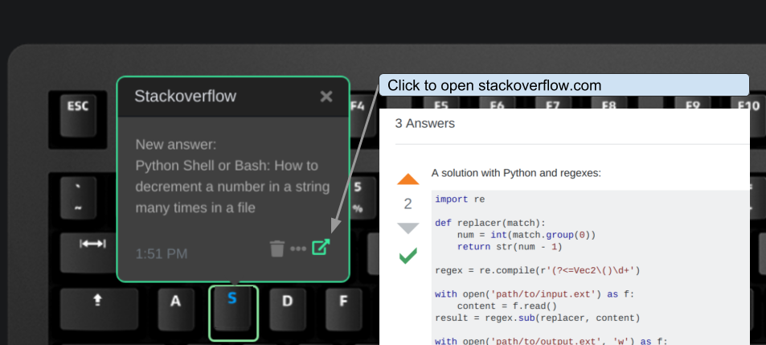

# Q Applet: Stack Overflow

This applet notifies for unread inbox items from a Stackoverflow account by
making a Das Keyboard Q key blink in blue.

Stack Overflow is a question and answer site for professional and enthusiast programmers. It's built and run by you as part of the Stack Exchange network of Q&A sites. With your help, we're working together to build a library of detailed answers to every question about programming.

For more information visit <https://www.stackoverflow.com>.

## Changelog

[CHANGELOG.MD](CHANGELOG.md)

## Installation

Requires a Das Keyboard Q Series: www.daskeyboard.com.

Installation, configuration and uninstallation of applets is done within
the Q Desktop application [https://www.daskeyboard.com/q](https://www.daskeyboard.com/q)

## Running tests

- `yarn test`

## Contributions

Pull requests welcome.

## Copyright / License

Copyright 2014 - 2019 Das Keyboard / Metadot Corp.

Licensed under the GNU General Public License Version 2.0 (or later);
you may not use this work except in compliance with the License.
You may obtain a copy of the License in the LICENSE file, or at:

   [http://www.gnu.org/licenses/old-licenses/gpl-2.0.txt](http://www.gnu.org/licenses/old-licenses/gpl-2.0.txt)

Unless required by applicable law or agreed to in writing, software
distributed under the License is distributed on an "AS IS" BASIS,
WITHOUT WARRANTIES OR CONDITIONS OF ANY KIND, either express or implied.
See the License for the specific language governing permissions and
limitations under the License.
